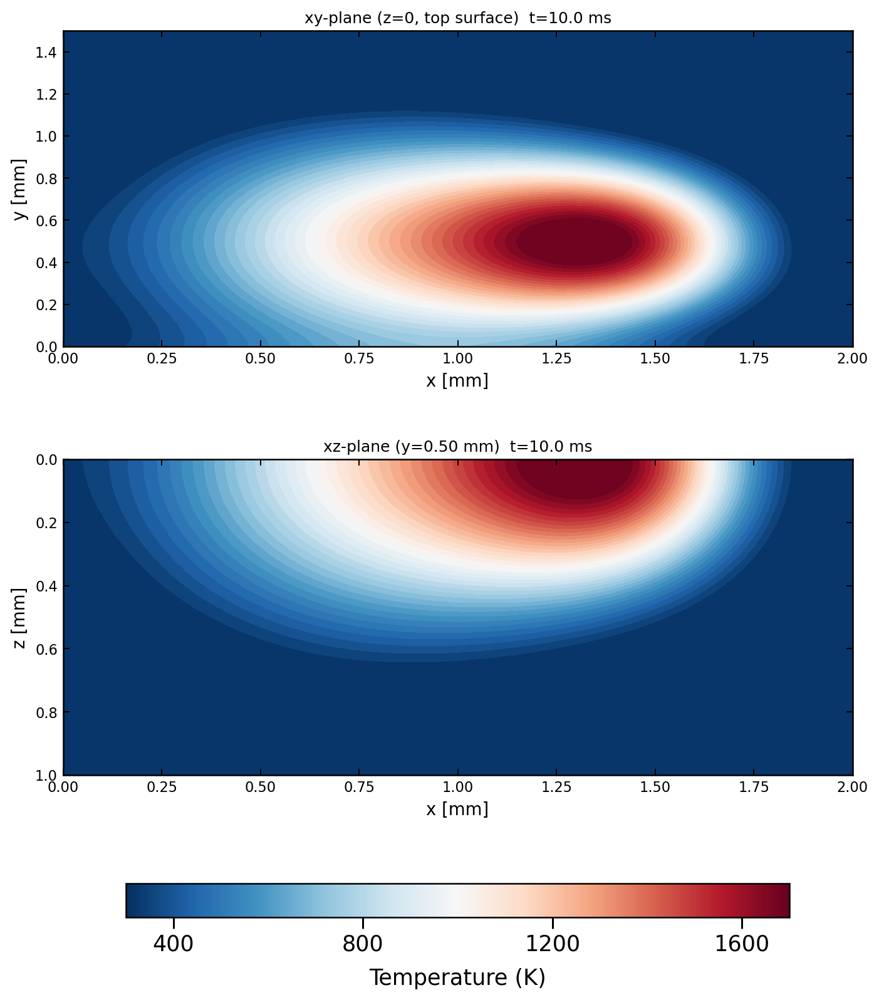
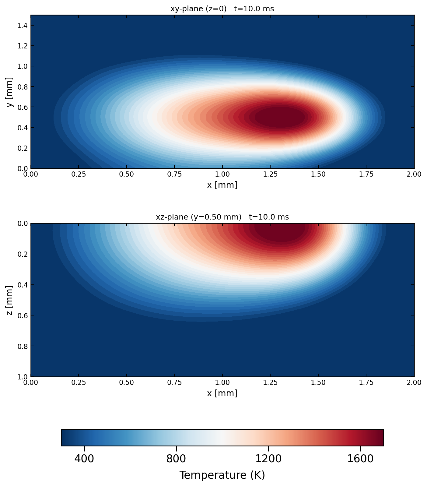
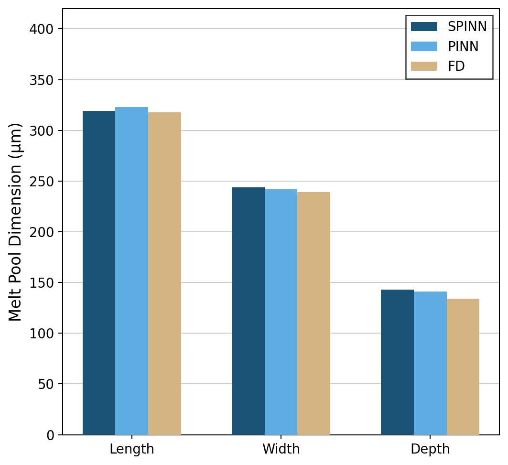

# PINN vs SPINN for LPBF Thermal Modelling

Specialization project at the Institute for Computational Modeling in Civil Engineering (iRMB),
TU Braunschweig, 2026.

## Overview

This repository contains two physics-informed neural network implementations for predicting
the 3D transient temperature field during single-track Laser Powder Bed Fusion (LPBF):

- **PINN** — a standard coordinate-based MLP (PyTorch)
- **SPINN** — a separable per-axis architecture (JAX/Flax)

Both models solve the 3D heat equation without any simulation data. The physics — a Goldak
volumetric heat source and temperature-dependent material properties for Hastelloy X — is
enforced entirely through the loss function. A CUDA-accelerated finite-difference (FD) solver
is used as the ground-truth reference ([FD solver repository](https://github.com/shubhamthedev/lpbf-fd-solver)).

## Motivation

Standard PINNs process every collocation point individually. In a 3D+time problem the number
of points scales as N⁴, which quickly exhausts GPU memory and training time. SPINNs
(Cho et al., NeurIPS 2023) decompose the network into four independent axis-networks and
merge their outputs via outer product, reducing the cost to 4N forward passes. This project
provides a controlled comparison of both approaches on the same LPBF thermal problem.

## Problem Setup

| | |
|---|---|
| **Domain** | 2.0 × 1.5 × 1.0 mm (x × y × z) |
| **Material** | Hastelloy X (temperature-dependent κ and cₚ) |
| **Laser** | 150 W absorbed, r = 450 µm, penetration depth = 500 µm |
| **Scan** | 100 mm/s along x, from x = 0.5 mm to x = 1.5 mm at y = 0.50 mm |
| **Duration** | 10 ms |
| **Heat source** | Goldak volumetric model |
| **Initial condition** | T₀ = 300 K (hard-enforced by network ansatz) |
| **Top surface (z = 0)** | Robin BC: −κ ∂T/∂z = h(T − T∞), h = 10 W/(m²K) |
| **Bottom (z = Lz)** | Dirichlet BC: T = 300 K (substrate) |
| **Side faces** | Neumann BC: ∂T/∂n = 0 (insulated) |

## Models

### PINN (`pinns.py` — PyTorch)

A single MLP maps non-dimensionalized coordinates (x, y, z, t) to temperature.

- **Architecture:** 6 hidden layers × 128 neurons, tanh activation
- **Hard IC ansatz:** T = T₀ + t · network(x,y,z,t) · ΔT_char — guarantees T(t=0) = T₀ exactly
- **Collocation:** 4 096 Sobol points + 16 384 laser-clustered points
- **Training:** two-phase Adam — 12 000 steps with cosine warm restarts (lr = 5×10⁻⁴), then 8 000 steps fine-tuning (lr = 1×10⁻⁵)
- **Loss:** L_pde + w_bc · L_bc

### SPINN (`spinns.py` — JAX/Flax)

Four separate axis-MLPs (t, x, y, z) whose rank-64 feature vectors are merged via
`einsum('tr,xr,yr,zr->txyz')`.

- **Architecture:** 4 × (5 hidden layers × 64 neurons, tanh), rank 64
- **Hard IC ansatz:** same form as PINN
- **Collocation:** factorizable lattice — 64×128×96×48 per-axis points with laser-focused clustering; resampled every step
- **Derivatives:** forward-mode AD (JVP) for all PDE residual terms
- **Training:** two-phase Adam — 15 000 steps with linear warmup + cosine decay (peak lr = 8×10⁻⁴), then 15 000 steps fine-tuning (lr = 1×10⁻⁵)
- **Loss:** L_pde + L_bc

### FD Solver (reference — separate repository)

CUDA-accelerated explicit forward-Euler finite-difference solver on a 201 × 51 × 51 grid
(Δt = 1 µs). Temperature-dependent κ(T) and apparent cₚ(T) including latent heat via a
Gaussian peak.

→ [FD solver repository](https://github.com/shubhamthedev/lpbf-fd-solver)

## Results

### Temperature snapshots at t = 10 ms

**PINN**

  

**SPINN**

  

### Accuracy (MAPE vs FD reference)

| Plane | PINN | SPINN |
|---|---|---|
| xy (top surface) | 2.49 % | 2.30 % |
| xz (centerline) | 0.90 % | 1.27 % |
| Combined | 1.69 % | 1.78 % |

**Meltpool comparison**

  

---

*iRMB, TU Braunschweig, 2026*